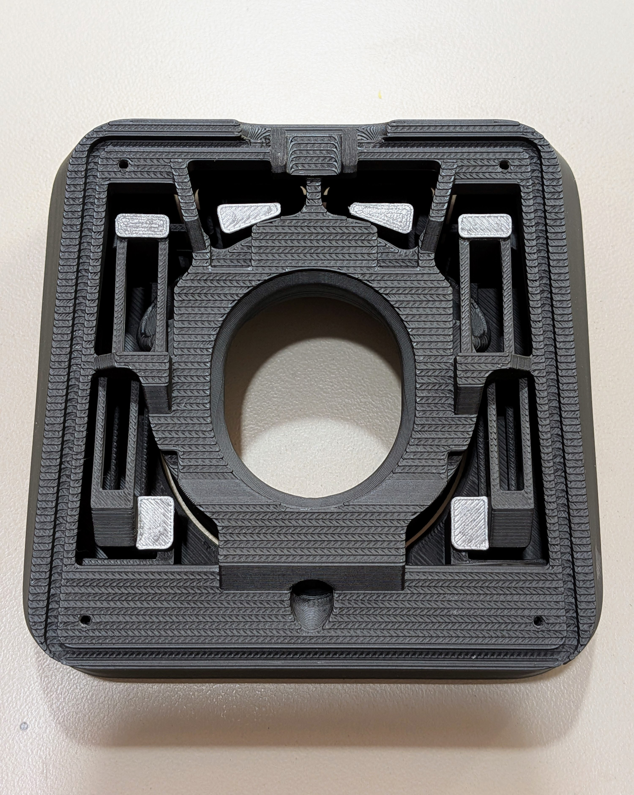

# Adept_BLE_3-pin

Took open source [Adept BLE design](https://github.com/taichan1113/AdeptBLE) and altered PCB &amp; casing for 3-pin micro switches.

Note that the casing is designed for **1.2mm thick PCBs.** Very important.

My version of ZMK firmware is [here.](https://github.com/kaihchang/zmk-config-adept)

Altered PCB:

Altered cases:

Finished build:

Supports BTU and magnet caps. BTW I used CY-8H BTUs and wasn't really satisfied with the quality, even after lubing with grease. SP-8 ones may be a better bet if *Rexroth R053XX8XX (7210)* isn't available or out of price range.

